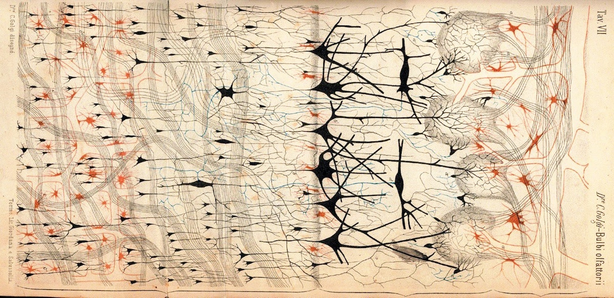

# Datenportfolio «Mental Health» FS24

_Psychische Gesundheit: Zustand des Wohlbefindens, in dem der Einzelne seine Fähigkeiten ausschöpfen, die normalen Lebensbelastungen bewältigen, produktiv und fruchtbar arbeiten kann und imstande ist, etwas zu seiner Gemeinschaft beizutragen._  
_(WHO, 2001)_

_Illustration of the Nervous System, Camillo Golgi and Santiago Ramón y Cajal, 1885_

Eine Sammlung von Datensätzen zum Thema «Mental Health» welche im Frühlingssemester 2024 im Bachelor Data Design + Art für die Projektarbeit in den Modulen «Think2/4» und «Play2/4» verwendet werden. Öffentlich zugängliche Datensätze sind direkt verlinkt. Datensätze welche aus unterschiedlichen Gründen nicht öffentlich geteilt werden können sind auf Anfrage der Studierenden beim DD + A Team verfügbar. 

## Allgemeine Datensätze

- [OBSAN](https://www.obsan.admin.ch/de/gesundheitsthemen/psychische-gesundheit) Schweizerisches Gesundheitsobservatorium, Bericht _Psychische Gesundheit 2023_, Daten bei DD + A
- Bundesamt für Statistik BFS, _[Psychische Gesundheit](https://www.bfs.admin.ch/bfs/de/home/statistiken/gesundheit/gesundheitszustand/psychische.html)
- World Health Organisation, _[Indicators Index](https://www.who.int/data/gho/data/indicators/indicators-index)_
- Netzwerk Psychische Gesundheit Schweiz, _[Dokumentensammlung](https://www.npg-rsp.ch/dokumente.html)_
- Prevention.ch, _[Artikel und Berichte](https://www.prevention.ch/)_

### Allgemeine weitere Datenportale

- European data, *[data.europa.eu «Mental Health»](https://data.europa.eu/data/datasets?query=Mental%20Health&locale=de)*
- Landscaping International Logitudinal Datasets, [Report and Datasets](https://www.landscaping-longitudinal-research.com/)
## Stress

- Bundesamt für Statistik BFS, *[Wirtschaftliche und soziale Situation der Bevölkerung](https://www.bfs.admin.ch/bfs/de/home/statistiken/wirtschaftliche-soziale-situation-bevoelkerung.html)*
- Bundesamt für Statistik BFS, *[Soziale Sicherheit](https://www.bfs.admin.ch/bfs/de/home/statistiken/soziale-sicherheit.html)*
- Obsan, _[IV-Neurenten aufgrund Krankheit (Alter: 18–Rentenalter)](https://ind.obsan.admin.ch/indicator/monam/iv-neurenten-aufgrund-krankheit-alter-18-rentenalter)_
- Gesundheitsförderung Schweiz, *[Job-Stress-Index 2022](https://friendlyworkspace.ch/de/themen/arbeitsbedingter-stress/studie-job-stress-index)*

## Sucht (inkl. Medienkonsum)

- Sucht Schweiz, *[Zahlen & Fakten](https://www.suchtschweiz.ch/zahlen-und-fakten/)*, weitere Daten via [Tableu Public](https://public.tableau.com/app/profile/addiction.suisse/vizzes)
- Health Behaviour in School-aged Children (HBSC), [_Schweizer Schülerinnen- und Schülerbefragung zum Gesundheitsverhalten_](https://www.hbsc.ch/de/startseite.html)
- Obsan, [_Sucht: Entwicklung der Eintritte in Behandlung_](https://ind.obsan.admin.ch/indicator/monam/sucht-entwicklung-der-eintritte-in-behandlung)
- Obsan, [*MonAM Schweizer Monitoring-System Sucht und nichtübertragbare Krankheiten*](https://ind.obsan.admin.ch/monam)
- Bundesamt für Statistik BFS, *[Forschungsberichte Verhaltenssüchte](https://www.bag.admin.ch/bag/de/home/das-bag/publikationen/forschungsberichte/forschungsberichte-sucht/forschungsberichte-verhaltenssuechte.html)*
- Prevention.ch, _[Artikel und Berichte](https://www.prevention.ch/)_
- HSLU, *[Die Spielsperre als Massnahme des Spielerschutzes](https://mycampus.hslu.ch/de-ch/hochschule-luzern/hochschule-luzern/forschung/projekte/detail/?pid=4007)*, Datensatz auf *[Swissubase](https://www.swissubase.ch/en/catalogue/studies/20254/latest/datasets/2366/2853/overview)*
- Bundesamt für Statistik BFS, *[Kultur, Medien, Informationsgesellschaft, Sport](https://www.bfs.admin.ch/bfs/de/home/statistiken/kultur-medien-informationsgesellschaft-sport.html)*
- Oxford Internet Institute, *[No ‘smoking gun’ mental health harm from internet: landmark Oxford survey](https://www.oii.ox.ac.uk/news-events/no-smoking-gun-mental-health-harm-from-internet-landmark-oxford-survey/)*, [Dataset](https://zenodo.org/records/8387775)

## Soziale Ressourcen, soziodemographische Faktoren

- Obsan, *[Soziale Ressourcen als Gesundheitsschutz](# Soziale Ressourcen als Gesundheitsschutz)*
- Bundesamt für Statistik BFS, *[Subjektive Einschätzung des psychischen Wohlbefindens, nach verschiedenen soziodemografischen Merkmalen](https://opendata.swiss/de/dataset/subjektive-einschatzung-des-psychischen-wohlbefindens-nach-verschiedenen-soziodemografischen-me)*
- Bundesamt für Statistik BFS, *[Einsamkeitsgefühl](https://www.bfs.admin.ch/bfs/de/home/statistiken/bevoelkerung/migration-integration/integrationindikatoren/gesundheit/einsamkeitsgefuhl.html)*
- Bundesamt für Statistik BFS, *[Wirtschaftliche und soziale Situation der Bevölkerung](https://www.bfs.admin.ch/bfs/de/home/statistiken/wirtschaftliche-soziale-situation-bevoelkerung.html)*
- Bundesamt für Statistik BFS, *[Erwerbslosigkeit, Unterbeschäftigung und offene Stellen](https://www.bfs.admin.ch/bfs/de/home/statistiken/arbeit-erwerb/erwerbslosigkeit-unterbeschaeftigung.html)*
- Bundesamt für Statistik BFS, *[Gesundheit von LGBT-Personen](https://www.bag.admin.ch/bag/de/home/strategie-und-politik/nationale-gesundheitsstrategien/gesundheitliche-chancengleichheit/forschung-zu-gesundheitlicher-chancengleichheit/gesundheit-von-lgbt-personen.html)*

## Traumata

- Bundesamt für Statistik BFS, *[Kriminalität und Strafrecht](https://www.bfs.admin.ch/bfs/de/home/statistiken/kriminalitaet-strafrecht.html)*
- Corona Immunitas, [Berichte](https://www.corona-immunitas.ch/), [Datensätze](https://zenodo.org/search?q=metadata.creators.person_or_org.name%3A%22Corona%20Immunitas%20Working%20Group%22&l=list&p=1&s=10&sort=bestmatch)
- Bundestamt für Statistik BFS, *[Finanzielle Situation und psychische Gesundheit der Studierenden während der Covid-19-Pandemie im Jahr 2020](https://opendata.swiss/de/dataset/finanzielle-situation-und-psychische-gesundheit-der-studierenden-wahrend-der-covid-19-pand-2020)*

